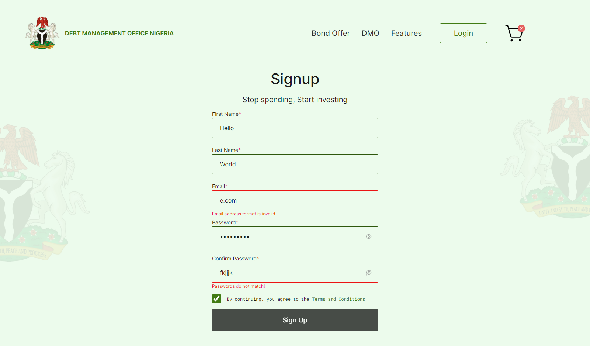

This is a solution to the [Hasob Integrated Services Limited recruitment pre-assessment task](https://github.com/Hasob-Intergrated-Services-Limited/FrontendTask). 

## Table of contents

- [Overview](#overview)
  - [The challenge](#the-challenge)
  - [Screenshots](#screenshot)
  - [Links](#links)
- [My process](#my-process)
  - [Built with](#built-with)
  - [What I learned](#what-i-learned)
- [Author](#author)
- [Acknowledgments](#acknowledgments)

## Overview

### The challenge

Build a simple website according to the images found in the task repo

- Project should be built with ReactJS
- Website should be responsive
- Website should be interactive
- Task should be completed in 2 weeks

### Screenshots

### Links

- Solution URL: (https://www.github.com/codegiyu/debt-management)
- Live Site URL: (https://debt-management.vercel.app)

## My process

I used ReactJS for my build, with TailwindCSS, Zustand for global state management, downloaded icons as SVGs from iconify. I also created a database and a few API routes with ExpressJs and MongoDB for login, register and fetching bonds. That repo can be found at [DMON-Database](https://www.github.com/codegiyu/debt-management-database). 

With proper state management and passing of props I made the website as interactive as I could make it. The checkout page and the register page should be about the most interactive of the bunch.

I also created a custom dummy bond template for suspense while the bonds data is being fetched.

### Built with

- ReactJS
- TailwindCSS
- API
- Zustand
- CSS custom properties
- Flexbox
- Desktop-first workflow

### What I learned

I experiences a few firsts during this project. 

- First time creating a suspense dummy to await fetched data instead of some kind of loading screen
- First time creating working MongoDB database and API routes.

I also deepened my knowledge of working with a few things I'm already familiar with like global state management.

## Author

- GitHub - [Codegiyu](https://www.github.com/codegiyu)
- Portfolio - [Codegiyu](https://portfolio-codegiyu.vercel.app)
- Twitter - [@TheLonerider20](https://www.twitter.com/TheLonerider20)

## Acknowledgments

Thanks to God for giving me the strength to complete this even during the busy holiday period.